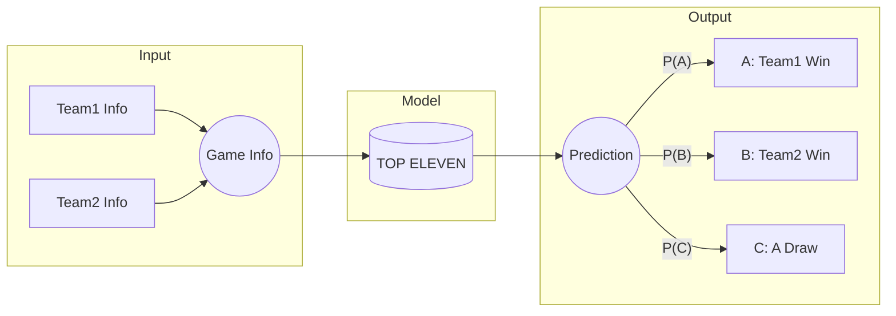
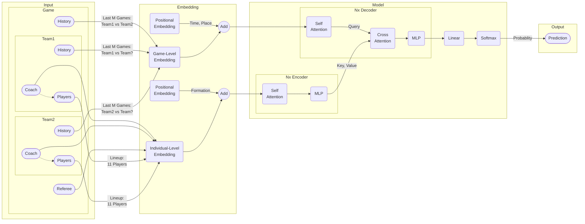

# top_eleven

> **Note**: The project focus is now a **football-only, pre-match lottery prediction
> system**. See [docs/design.md](docs/design.md) for the updated design and
> [docs/milestones.md](docs/milestones.md) for the phased execution plan.

## Objective
This project builds pre-match models that output calibrated probabilities and map
them to football lottery play types.

Current target play types:

- Fulltime 1X2
- Halftime/Fulltime 1X2
- Handicap 1X2

Label definition note: fulltime means 90 minutes plus stoppage/injury time,
excluding extra time and penalty shootouts.

The first implementation prioritizes simplicity: pre-match features only, no live
streaming inputs.

### Original Objective (pre-match, three-class)
The original formulation aimed to predict the outcome of a football game based on
information of the two teams available before kick-off.



## Documentation

| Document | Description |
|----------|-------------|
| [docs/design.md](docs/design.md) | Problem definition, data schema, model architecture, repo structure |
| [docs/milestones.md](docs/milestones.md) | Phased execution plan with per-task checklist and decision gates |

---

## Problem Formulation

This is essentially a multi-class classification problem, where the number of classes $K=3$.

The expected output of the model is the predicted probability for each class:
* $P(A) \in [0, 1]$: The probability for event $A$ that *Team1* wins the game.
* $P(B) \in [0, 1]$: The probability for event $B$ that *Team2* wins the game.
* $P(C) \in [0, 1]$: The probability for event $C$ that the game ends in a draw.

Note that $P(A) + P(B) + P(C) = 1$.

## The Model

The model is a standard Transformer which follows the general encoder-decoder framework.




## The Folder Structure

### Current (prototype)
```shell
.
├── data
│   └── data_loader.py
├── nn_modules
│   ├── decoder
│   ├── embedding
│   ├── encoder
│   └── transformer
├── docs
│   ├── design.md
│   └── milestones.md
├── README.md
├── scripts
│   ├── eval.py
│   ├── test.py
│   └── train.py
└── utils
```

### Target (see [docs/design.md](docs/design.md) Section 8)
```shell
.
├── config/
│   ├── config.json
│   ├── data_config.json
│   ├── feature_config.json
│   └── experiment_config.json
├── data/
│   ├── raw/
│   ├── processed/
│   ├── schemas.py
│   ├── build_dataset.py
│   └── data_loader.py
├── nn_modules/
│   ├── encoders/
│   ├── fusion/
│   ├── heads/
│   └── multimodal/
├── scripts/
│   ├── build_dataset.py
│   ├── train_baseline.py
│   ├── train_multimodal.py
│   ├── eval.py
│   └── infer_live.py
├── utils/
│   ├── metrics.py
│   ├── calibration.py
│   ├── split.py
│   └── logging.py
├── docs/
│   ├── design.md
│   └── milestones.md
└── README.md
```
