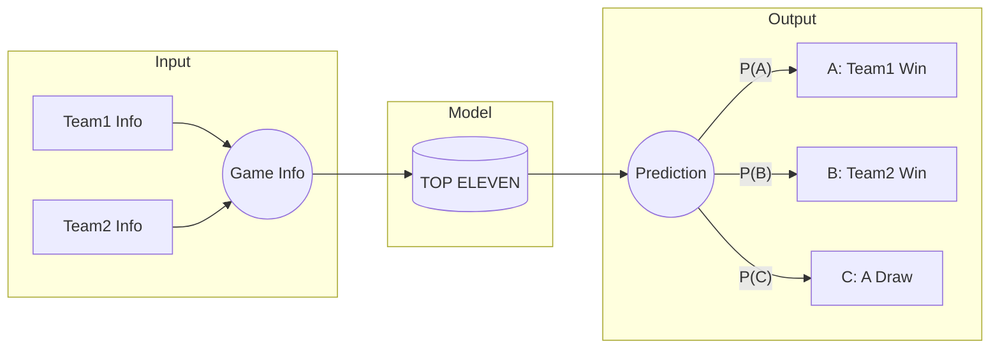
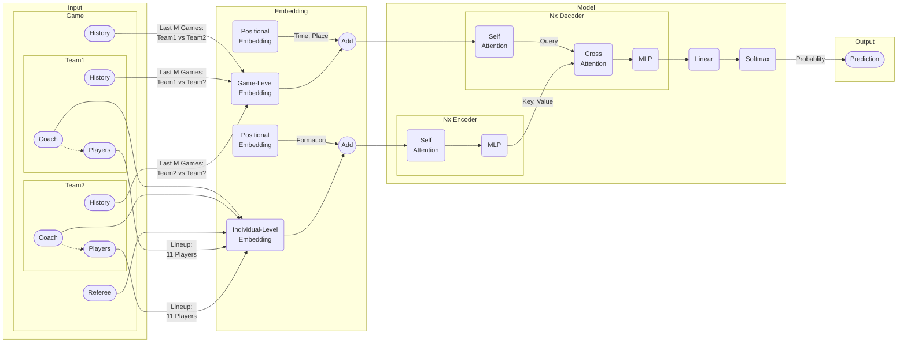

# top_eleven

> **Note**: The project focus is now a **football-only, pre-match lottery prediction
> system**. See [docs/design.md](docs/design.md) for the updated design and
> [docs/milestones.md](docs/milestones.md) for the phased execution plan.

## Objective
This project builds pre-match models that output calibrated probabilities and map
them to football lottery play types.

Current target play types:

- Fulltime 1X2
- Halftime/Fulltime 1X2
- Handicap 1X2

Label definition note: fulltime means 90 minutes plus stoppage/injury time,
excluding extra time and penalty shootouts.

The first implementation prioritizes simplicity: pre-match features only, no live
streaming inputs.

### Original Objective (pre-match, three-class)
The original formulation aimed to predict the outcome of a football game based on
information of the two teams available before kick-off.


```mermaid
graph LR;
    subgraph Input
        team1[Team1 Info];
        team2[Team2 Info];
        game((Game Info));
    end
    subgraph Model
        model[(TOP ELEVEN)];
    end
    subgraph Output
        pred((Prediction));
        team1_win[A: Team1 Win];
        team2_win[B: Team2 Win];
        draw[C: A Draw];
    end
    team1-->game;
    team2-->game;
    game-->model;
    model-->pred;
    pred--P(A)-->team1_win;
    pred--P(B)-->team2_win;
    pred--P(C)-->draw;
```

## Documentation

| Document | Description |
|----------|-------------|
| [docs/design.md](docs/design.md) | Problem definition, data schema, model architecture, repo structure |
| [docs/milestones.md](docs/milestones.md) | Phased execution plan with per-task checklist and decision gates |

---

## Quick Start — Issue-Date Pick Generation (Phase 7)

Generate issue-date picks in ~30 seconds (historical/simulation workflow):

```bash
conda activate top-eleven

# Default date is today; this works only when that date already has completed
# matches in the local dataset (replay/simulation use-case)
python scripts/issue_predict.py

# Picks for a specific date (simulation/backtest mode)
python scripts/issue_predict.py --date 2025-03-15

# Tighter filter (fewer but higher-confidence picks)
python scripts/issue_predict.py --date 2025-03-15 \
    --ev-threshold 0.10 --min-confidence 0.60

# Handicap only, show top 5 picks
python scripts/issue_predict.py --date 2025-03-15 \
    --tasks handicap_label --top-n 5

# Save picks to custom path
python scripts/issue_predict.py --date 2025-03-15 \
    --output output/picks/2025-03-15.json
```

**Recommended defaults**: `--ev-threshold 0.05 --min-confidence 0.55`
(Backtest: Handicap test ROI +4.3%, 1216 bets/season, hit-rate 55.5%)

**Output**: CLI pick slip table + JSON file at `output/picks/<date>.json`

> **Note on odds**: The current pipeline uses European bookmaker odds as a proxy.
> China Lottery parimutuel odds differ (higher take-out ~35%).
> `lottery_market_cn.jsonl` from `fetch_cn_odds.py` stores post-match settlement
> SP for the realized outcome only, so it should not be used with
> `backtest_ev.py --market` for pre-match EV screening.
> Use it only in settlement-aware analysis paths (for example
> `cn_lottery_backtest.py`) or replace it with true pre-match snapshots.

---

## Reproducible Backtest (Phase 6)

```bash
# Full Phase 6 backtest pipeline (predictions + EV sweep + sensitivity analysis)
bash scripts/run_phase6.sh
```

Results (LightGBM 46-feat, European odds proxy):

| Task | Config | Val ROI | Test ROI | Test Bets |
|------|--------|---------|---------|-----------|
| Handicap 1X2 | EV≥0.05, conf≥0.55 | +9.7% | **+4.3%** | 1216 |
| Fulltime 1X2 | any | negative | negative | — |

---

## Environment Setup (Conda Only)

This project currently uses a conda-first workflow for local development.
For now, use conda as the single source of truth for dependencies.

Create and activate the environment:

```bash
conda env create -f environment.yml
conda activate top-eleven
```

Update the environment after dependency changes:

```bash
conda env update -f environment.yml --prune
```

Remove the environment (if needed):

```bash
conda env remove -n top-eleven
```

Notes:
- Keep dependencies in `environment.yml` up to date when adding packages.
- Use one shared environment name: `top-eleven`.
- Docker is intentionally deferred until later phases.

---

## Problem Formulation

This is essentially a multi-class classification problem, where the number of classes $K=3$.

The expected output of the model is the predicted probability for each class:
* $P(A) \in [0, 1]$: The probability for event $A$ that *Team1* wins the game.
* $P(B) \in [0, 1]$: The probability for event $B$ that *Team2* wins the game.
* $P(C) \in [0, 1]$: The probability for event $C$ that the game ends in a draw.

Note that $P(A) + P(B) + P(C) = 1$.

## The Model

The model is a standard Transformer which follows the general encoder-decoder framework.


```mermaid
graph LR
    subgraph Input
        subgraph Game
            history(["History"]);
            subgraph Team1
                history1(["History"]);
                coach1(["Coach"]);
                players1(["Players"]);
                coach1-.->players1;
            end
            subgraph Team2
                history2(["History"]);
                coach2(["Coach"]);
                players2(["Players"]);
                coach2-.->players2;
            end
            ref(["Referee"]);
        end
    end

    subgraph Embedding
        ge("Game-Level\nEmbedding");
        gpe("Positional\nEmbedding");
        ie("Individual-Level\nEmbedding");
        ipe("Positional\nEmbedding");
        gadd(("Add"));
        iadd(("Add"));
    end

    subgraph Model
        subgraph Nx Encoder
            enc_sa("Self\nAttention");
            enc_mlp("MLP");
            enc_sa-->enc_mlp;
        end
        subgraph Nx Decoder
            dec_sa("Self\nAttention");
            dec_xa("Cross\nAttention");
            dec_mlp("MLP");
            dec_sa--"Query"-->dec_xa;
            dec_xa-->dec_mlp;
        end
        enc_mlp--"Key, Value"-->dec_xa;
        softmax("Softmax");
        linear("Linear");
        dec_mlp-->linear;
        linear-->softmax;
    end

    subgraph Output
        pred(["Prediction"]);
    end

    history--"Last M Games:\nTeam1 vs Team2"-->ge;
    history1--"Last M Games:\nTeam1 vs Team?"-->ge;
    history2--"Last M Games:\nTeam2 vs Team?"-->ge;

    gpe--"Time, Place"-->gadd;
    ge-->gadd;

    gadd-->dec_sa;

    coach1-->ie;
    coach2-->ie;
    ref-->ie;
    players1--"Lineup:\n11 Players"-->ie;
    players2--"Lineup:\n11 Players"-->ie;

    ipe--"Formation"-->iadd;
    ie-->iadd;

    iadd-->enc_sa;

    softmax--"Probablity"-->pred;
```


## The Folder Structure

### Current (prototype)
```shell
.
├── data
│   └── data_loader.py
├── nn_modules
│   ├── decoder
│   ├── embedding
│   ├── encoder
│   └── transformer
├── docs
│   ├── design.md
│   └── milestones.md
├── README.md
├── scripts
│   ├── eval.py
│   ├── test.py
│   └── train.py
└── utils
```

### Target (see [docs/design.md](docs/design.md) Section 8)
```shell
.
├── config/
│   ├── config.json
│   ├── data_config.json
│   ├── feature_config.json
│   └── experiment_config.json
├── data/
│   ├── raw/
│   ├── processed/
│   ├── schemas.py
│   ├── build_dataset.py
│   └── data_loader.py
├── nn_modules/
│   ├── encoders/
│   ├── fusion/
│   ├── heads/
│   └── multimodal/
├── scripts/
│   ├── build_dataset.py
│   ├── train_baseline.py
│   ├── train_multimodal.py
│   ├── eval.py
│   └── infer_live.py
├── utils/
│   ├── metrics.py
│   ├── calibration.py
│   ├── split.py
│   └── logging.py
├── docs/
│   ├── design.md
│   └── milestones.md
└── README.md
```
